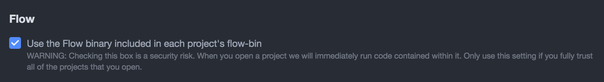

# Flow with Atom

## Packages Recommended

### Nuclide
[Nuclide](https://nuclide.io) is built as a single package on top of Atom to provide hackability and the support of an active community.
It provides a first-class development environment for React Native, Hack and Flow projects.

##### How to install
```
apm install nuclide
```

After nuclide is installed, go to its settings and check **Use the Flow binary included in each project's flow-bin**.


