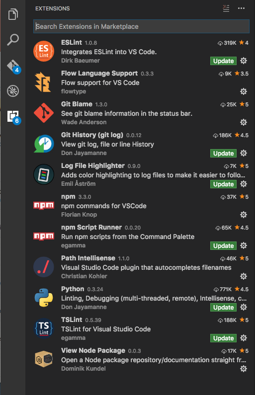

# Flow with VSCode

## Packages Recommended

### Flow for VSCode
[Flow for VSCode](https://github.com/flowtype/flow-for-vscode) adds Flow support for VS Code. Flow is a static type checker, designed to find type errors in JavaScript programs.

### How to install

#### Preferred
* Use the [rally-vscode repo](https://github.com/RallySoftware/rally-vscode)
* Installed extensions should look something like this:

OR

* Install from VSCode extensions
* Add `"javascript.validate.enable": false` to your workspace preference
