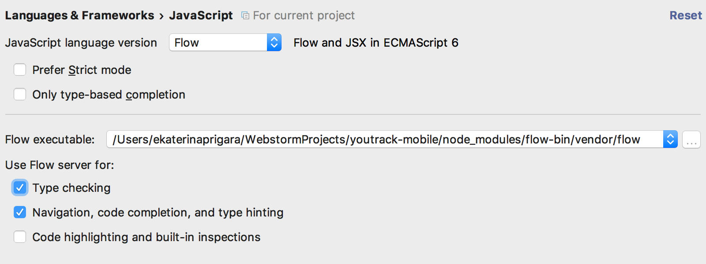

# Flow with Webstorm

### How to install**
* Go to Preferences | Languages & Frameworks | JavaScript in WebStorm and set language version to Flow. WebStorm will then understand Flow type annotations in your code.

* Check that the path to Flow is specified with a valid location for a flow executable. If it’s correct, click OK to apply settings. You’re ready to go!

* Ensure the following are checked:
  * Type checking
  * Navigation, code completion, and type hinting

** According to Jetbrains docs, published 11/21/2016. (https://blog.jetbrains.com/webstorm/2016/11/using-flow-in-webstorm/)
